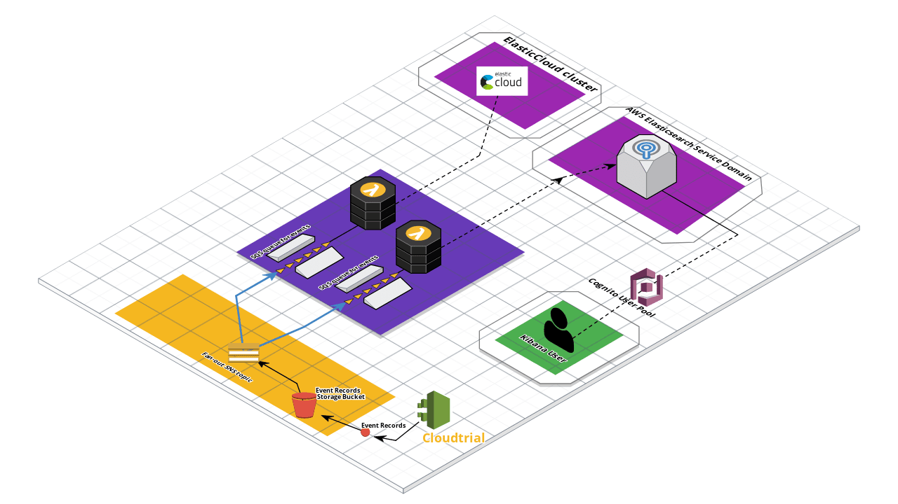

# s3-to-elasticsearch-cloudtrail (an [AWS CDK](https://aws.amazon.com/cdk/) project)

Send Cloudtrail logs to Elasticsearch.  


[Live Architecture Diagram Link - TBD](https://app.cloudcraft.co/view/e427f145-3e9b-4362-aed6-0b4eba1403c8?key=xUrf3XVBsbKPpO119ObJbQ)




## Deployment using the AWS Console and AWS SAR

**The Serverless Application Repository** is a managed repository for serverless applications. It enables teams, organizations, and individual developers to store and share reusable applications, and easily assemble and deploy serverless architectures in powerful new ways. Using the Serverless Application Repository, you don't need to clone, build, package, or publish source code to AWS before deploying it. Instead, you can use pre-built applications from the Serverless Application Repository in your serverless architectures, helping you and your teams reduce duplicated work, ensure organizational best practices, and get to market faster. 
 More information on the SAR can be found [here](https://aws.amazon.com/serverless/serverlessrepo/).
 
### Steps

```
 You must have adequate permissions or use the "Administrator" IAM policy 
 
	1. Login to the AWS Console
	2. Navigate to the AWS SAR console
		 https://console.aws.amazon.com/serverlessrepo/home
	3. Click on or navigate to Available applications
		 https://console.aws.amazon.com/serverlessrepo/home?region=us-east-1#/available-applications
	4. Search for "S3 to Elasticsearch" in the search box 
	5. Click the title of the result Authored by Adrian Drummond
	6. Enter parameters for the Application 
	7. Click deploy
```

 
 

## Deployment using the CLI

**Command line** deployment is done using the AWS CDK `synth` and `deploy` commands.  Instructitons to install the AWS CDK can be found [here](https://docs.aws.amazon.com/cdk/latest/guide/getting_started.html#getting_started_install).


### Steps

```
 You must have adequate permissions or use the "Administrator" IAM policy 
 
	1. Install the AWS CDK 
		Be sure to install the latest CDK release. 
	2. Navigate to the directory for this repository
	3. Run the command:
		aws cdk synth
	5. 


## Configuration after deployment

**Markdown** is a plain text formatting syntax created by John Gruber, aiming to provide a easy-to-read and feasible markup. The original Markdown syntax specification can be found [here](http://daringfireball.net/projects/markdown/syntax).


